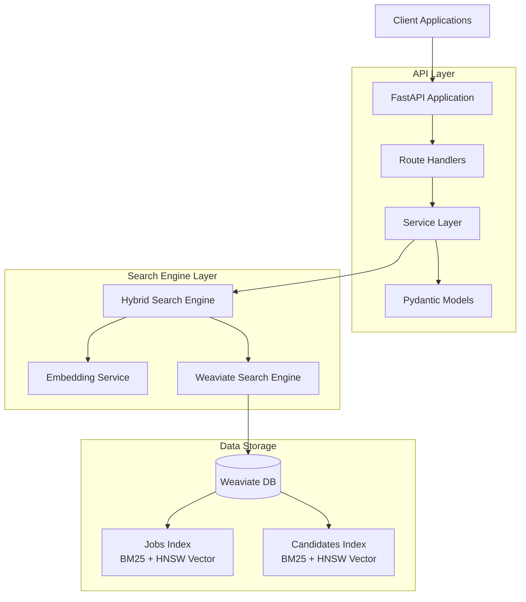

# Job-Candidate Matching Service

A FastAPI service for job-candidate retrieval using Weaviate's native hybrid search capabilities. This system combines BM25 sparse retrieval with dense vector embeddings to provide accurate, explainable job-candidate matching.

---

## Overview

### What it does

This project implements a hybrid search system that addresses the challenge of matching candidates to jobs and jobs to candidates using both keyword-based (BM25) and semantic (vector embedding) search techniques.

### Key Features

- **Native Hybrid Search**: Uses Weaviate's optimized BM25 + vector search fusion
- **Dual Fusion Methods**: Supports both relative score fusion and ranked fusion algorithms
- **Component Score Transparency**: Returns BM25, vector, and fused scores for each result
- **Advanced Filtering**: Location, remote work, skills, and language filtering
- **Real-time Performance**: Sub-50ms query response times with explainable results
- **Production Architecture**: Async FastAPI, comprehensive error handling, and type safety

---

## Architecture

### High-Level Overview



### Project Structure

```
candidate-matching/
├── api/                    # FastAPI application
│   ├── app.py             # Application factory with lifespan management
│   ├── models/            # Pydantic schemas for data validation
│   ├── routes/            # HTTP endpoints for ingestion, search, and matching
│   └── services/          # Business logic and service integrations
├── index/                 # Search engine implementation
│   ├── hybrid_search.py   # Hybrid search wrapper with score extraction
│   └── search_engine.py   # Core Weaviate client and schema management
├── data/                  # Generated datasets (61 jobs, 200 candidates)
├── tests/                 # Test suite
├── docker-compose.yml     # Container orchestration
└── example_calls.sh      # API usage examples and demos
```

---

## Quick Start

### Installation and Startup

```bash
git clone https://github.com/kalviskilups/candidate-matching.git
cd candidate-matching
cp .env.example .env
docker compose up -d
```

**Services will be available at:**
- API: http://localhost:8000
- Interactive Documentation: http://localhost:8000/docs
- Weaviate: http://localhost:8080

### Load Sample Data

Check if the services have loaded:

```bash
curl http://localhost:8000/
```

If everything has loaded, you can start the data ingestion process:

```bash
curl -X POST "http://localhost:8000/ingest/from-json?jobs_file=data/jobs.json&candidates_file=data/candidates.json"
```

**Expected response:**
```json
{
  "jobs_loaded": 61,
  "candidates_loaded": 200,
  "jobs_index_size": 61,
  "candidates_index_size": 200
}
```

---

## Usage Guide

### Basic Examples

**Search for Python jobs in Amsterdam:**
```bash
curl "http://localhost:8000/search/jobs?q=python+developer&k=3&location=Amsterdam&skills=python,fastapi"
```

**Find candidates for a specific job:**
```bash
curl "http://localhost:8000/match?job_id=job_002&k=3"
```

**Search remote DevOps candidates:**
```bash
curl "http://localhost:8000/search/candidates?q=devops+infrastructure&k=3&skills=kubernetes,docker&remote=true"
```

### More Examples

For comprehensive examples including semantic search, filtering combinations, and performance demonstrations, see the included `example_calls.sh` script.

**Example response showing hybrid scores:**
```json
{
  "total_results": 2,
  "fusion_method": "relative_score",
  "query_time_ms": 18.4,
  "results": [
    {
      "job": {
        "title": "Python Backend Developer",
        "skills": ["python", "fastapi", "django"],
        "location": {"city": "Amsterdam", "country": "Netherlands"},
        "language": "nl"
      },
      "scores": {
        "bm25": 0.500,
        "vector": 0.441,
        "fused": 0.941
      },
      "matched_snippet": "Ervaren Python ontwikkelaar gezocht voor onze backend team..."
    }
  ]
}
```

---

## API Reference

### Core Endpoints

#### **POST /ingest**

Ingest jobs and candidates from JSON payload.

**Example Response:**
```json
{
  "jobs_loaded": 1,
  "candidates_loaded": 1,
  "jobs_index_size": 62,
  "candidates_index_size": 201
}
```

#### **POST /ingest/from-json**

Load data from filesystem JSON files.

**Example Response:**
```json
{
  "jobs_loaded": 61,
  "candidates_loaded": 200,
  "jobs_index_size": 61,
  "candidates_index_size": 200
}
```

#### **GET /search/jobs**

Search jobs using hybrid retrieval.

**Query parameters:**
- `q` (required): Search query text
- `k`: Number of results (1-100, default: 10)
- `location`: Filter by city or country (partial matching)
- `remote`: Filter by remote availability (true/false)
- `skills`: Comma-separated skills filter
- `language`: Language requirement filter

**Example Response:**
```json
{
  "total_results": 2,
  "fusion_method": "relative_score",
  "query_time_ms": 23.7,
  "results": [
    {
      "job": {
        "id": "job_002",
        "title": "Python Backend Developer",
        "description": "We are looking for a talented Python developer to join our backend team...",
        "skills": ["python", "fastapi", "django", "postgresql"],
        "location": {"city": "Amsterdam", "country": "Netherlands"},
        "employment_type": "full_time",
        "seniority": "mid",
        "language": "en",
        "salary_min": 60000,
        "salary_max": 80000,
        "remote": true,
        "created_at": "2025-09-12T10:30:00Z"
      },
      "scores": {
        "bm25": 0.500,
        "vector": 0.500,
        "fused": 1.000
      },
      "matched_snippet": "We are looking for a talented Python developer to join our backend team..."
    }
  ]
}
```

#### **GET /search/candidates**

Search candidates using hybrid retrieval. Same parameters as job search.

**Example Response:**
```json
{
  "total_results": 2,
  "fusion_method": "relative_score",
  "query_time_ms": 19.4,
  "results": [
    {
      "candidate": {
        "id": "candidate_087",
        "name": "Marco Rossi",
        "title": "DevOps Engineer",
        "summary": "Experienced DevOps engineer with expertise in Kubernetes and cloud infrastructure...",
        "skills": ["kubernetes", "docker", "terraform", "aws", "python"],
        "years_experience": 6,
        "location": {"city": "Milan", "country": "Italy"},
        "languages": ["en", "it"],
        "open_to_remote": true,
        "desired_salary": 65000,
        "right_to_work_eu": true,
        "last_updated": "2025-09-10T16:45:00Z"
      },
      "scores": {
        "bm25": 0.402,
        "vector": 0.500,
        "fused": 0.902
      },
      "matched_snippet": "Experienced DevOps engineer with expertise in Kubernetes and cloud infrastructure..."
    }
  ]
}
```

#### **GET /match**

Find candidates for a specific job.

**Query parameters:**
- `job_id` (required): Job identifier
- `k`: Number of candidates to return (1-100, default: 10)

**Example Response:**
```json
{
  "job_id": "job_002",
  "job_title": "Python Backend Developer",
  "total_matches": 2,
  "fusion_method": "relative_score",
  "query_time_ms": 21.2,
  "matches": [
    {
      "candidate": {
        "id": "candidate_034",
        "name": "Thomas Weber",
        "title": "Full Stack Python Developer",
        "summary": "Python developer with 4 years of experience in web development...",
        "skills": ["python", "fastapi", "react", "postgresql", "docker"],
        "years_experience": 4,
        "location": {"city": "Vienna", "country": "Austria"},
        "languages": ["en", "de"],
        "open_to_remote": true,
        "desired_salary": 68000,
        "right_to_work_eu": true,
        "last_updated": "2025-09-11T12:15:00Z"
      },
      "scores": {
        "bm25": 0.500,
        "vector": 0.500,
        "fused": 1.000
      },
      "match_explanation": "Strong skill overlap: python, fastapi, postgresql. Experience level matches job requirements."
    }
  ]
}
```

---

## Technical Deep Dive

### System Architecture

The system implements a hybrid search architecture that combines keyword-based search with semantic understanding of vector embeddings.

Rather than building custom fusion algorithms from scratch, a decision was made to leverage Weaviate's hybrid search capabilities, which allows us to achieve sub-50ms query response times while maintaining full score transparency for explainability.

### How Hybrid Search Really Works

#### **The BM25 Sparse Retrieval Component**

BM25 operates on carefully constructed searchable text that concatenates relevant fields from jobs and candidates. For jobs, this includes title, description, skills array, location components, employment type, and seniority level.

Weaviate actually implements BM25F (Best Matching 25 with Field weighting), which extends traditional BM25 with field-specific weighting capabilities. The standard parameters we use are:
- **k1=1.2** for term frequency saturation (prevents common terms from dominating)
- **b=0.75** for length normalization (balances document length bias)

These parameters can be tuned to further improve the search to your liking.

#### **Dense Vector Semantic Search Deep Dive**

The vector search component uses the `all-MiniLM-L6-v2` sentence transformer model to generate 384-dimensional embeddings. This model was selected for its computational efficiency. For better results consider using a larger or fine-tuned model. Larger models would provide better semantic understanding but at the cost of significantly increased memory usage, slower inference, and higher computational requirements. So try to find the optimal choice for your dataset.

Text embedding occurs during both ingestion and query time, with the system processing searchable text through the transformer model to generate normalized vectors that capture:
- Semantic relationships between concepts
- Synonyms and related terms
- Contextual meanings that pure keyword search misses entirely

#### **Fusion Algorithm Implementation**

Weaviate's hybrid search implements two fusion methods that we can choose between.

The default Relative Score Fusion normalizes both BM25 and vector scores to comparable ranges, then combines them using a weighted sum. This approach handles the fundamental challenge that BM25 scores can range from 0 to infinity while cosine similarities are bounded between 0 and 1.

The alternative Ranked Fusion approach uses reciprocal rank fusion (RRF), combining results based on their ranking positions rather than raw scores. This method is more robust to score distribution differences and can surface results that rank highly in either component even if their raw scores are modest.

### Data Processing and Optimization Pipeline

#### **Smart Ingestion Architecture**

The ingestion pipeline transforms raw job and candidate JSON into a hybrid-search-optimized format through several stages. Pydantic models provide validation, ensuring data integrity and type safety throughout the process. The system creates searchable text representations that are specifically optimized for both sparse and dense retrieval.

Embedding generation occurs in efficient batches using the sentence transformer model, with the system validating embedding dimensions (384) before storage and handling batch insertion through Weaviate's optimized bulk loading interface. Error handling ensures that partial failures don't corrupt the entire batch.

#### **Query Processing Flow Optimization**

When a search query comes in, the system triggers a parallel process where the text query goes directly to BM25 while simultaneously generating query embeddings for vector search. Weaviate executes both retrieval methods internally and applies the configured fusion algorithm before returning results - this parallelization is key to achieving fast response times.

### Score Processing and Result Explanation

The system extracts detailed scoring information from Weaviate's metadata to provide result explanations that users can actually understand.

### Advanced Job-to-Candidate Matching Logic

#### **Intelligent Query Generation**

The job matching system implements intelligent query generation that combines multiple job attributes into an optimized search query. It prioritizes job title and top skills, includes seniority level for experience matching. Query length is capped at 500 characters to prevent performance degradation while maintaining comprehensive coverage.

Filter generation creates candidate-specific filters from job requirements where language requirements become exact matches, location requirements handle remote work logic, and skill requirements use overlapping skill matching to find candidates with relevant but not necessarily identical skill sets.

---

## Data

### Dataset Overview

The dataset was generated using an LLM API call with the specification of the necessary fields and the amount of examples.

#### **Jobs Dataset (61 entries)**
- Industries: Software development, DevOps, ML/AI, Security, etc.
- Locations: Netherlands, Germany, and other EU countries
- Languages: Dutch and English with authentic localization
- Realistic salary ranges and skill requirements

#### **Candidates Dataset (200 entries)**
- Geographic distribution across EU with work authorization
- Experience range from 1-15+ years
- Multilingual capabilities
- Skills aligned with job market demands

### Data Schemas

#### **Job Schema**
```json
{
  "id": "string",
  "title": "string",
  "description": "string",
  "skills": ["string"],
  "location": {"city": "string", "country": "string"},
  "employment_type": "string",
  "seniority": "string",
  "language": "string",
  "salary_min": 0,
  "salary_max": 0,
  "remote": true,
  "created_at": "2025-09-12T00:00:00Z"
}
```

#### **Candidate Schema**
```json
{
  "id": "string",
  "name": "string",
  "title": "string",
  "summary": "string",
  "skills": ["string"],
  "years_experience": 0,
  "location": {"city": "string", "country": "string"},
  "languages": ["string"],
  "open_to_remote": true,
  "desired_salary": 0,
  "right_to_work_eu": true,
  "last_updated": "2025-09-12T00:00:00Z"
}
```

---

## Future Enhancements

### Changes in Architecture

#### **Reranking Pipeline Integration**

The current system could be significantly improved by adding a neural reranking stage after initial hybrid retrieval. This would work by:
- Using the current hybrid search to retrieve top 50-100 candidates
- Passing job-candidate pairs through a cross-encoder model
- Reordering results based on deeper semantic understanding of job-candidate fit

This approach would provide more nuanced matching.

#### **Pure BM25 + Fine-tuned Ranking Model**

An alternative architecture worth exploring would eliminate vector search entirely and instead:
- Use only BM25 for initial candidate retrieval (extremely fast, sub-10ms)
- Deploy a small language model fine-tuned specifically on job-candidate matching data
- Use the model to rerank the retrieved jobs or candidates in the correct order

This could achieve similar or better accuracy with lower infrastructure requirements.

### Model and Embedding Improvements

#### **Domain-Specific Embeddings**

Training embeddings specifically on recruitment data would likely improve semantic matching significantly. This could involve:
- Fine-tuning sentence transformers on job descriptions and CVs
- Creating domain-specific vocabulary for technical skills and roles
- Optimizing embeddings for recruitment-specific similarity patterns

#### **Finding the optimal model size**

Current implementation contains a small sentence transformer, which is optimal for spped, but might not be the most optimal in terms of results. It would be wise to research and test different general models, if fine-tuning is out of the question.

Also additionally to all of these enhancements, it would be best to try to adjust the parameters such as alpha, k1, b, and others to get the best possible results, as that optimization was not done during this implementation

---

## Development

### Local Development Setup

For development with hot reloading:

```bash
# Install Python dependencies
uv sync --extra dev

# Start Weaviate only
docker compose up -d weaviate

# Run API locally
uv run uvicorn main:app --reload
```

### Testing

```bash
# Run all tests
uv run pytest -v

# Run with coverage
uv run pytest --cov=. -v
```

### Code Quality

```bash
# Install pre-commit hooks
uv run pre-commit install

# Run formatting and linting
uv run ruff check .
uv run ruff format .
```